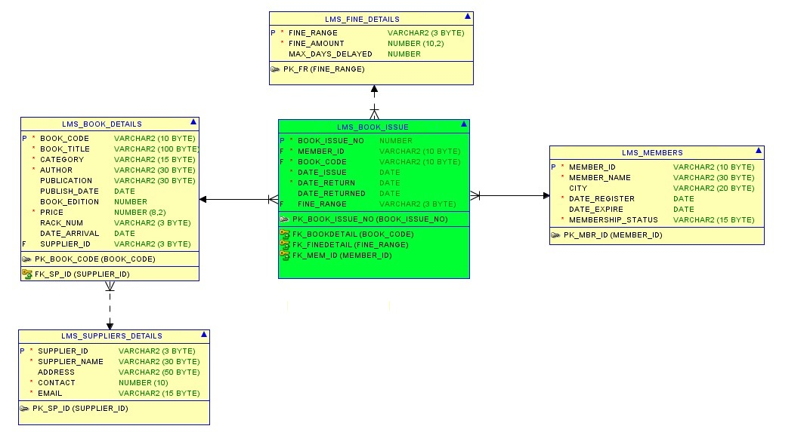

# Library_Management_System

### Library Management System with SQL  

This GitHub project is a comprehensive library management system developed using SQL.The system contains five tables: 
LMS_Book_Issue
LMS_Supplier_Details, 
LMS_Publishers
LMS_Members
LMS_Fine_Details 

Each table has its specific fields to store data related to books, supplier, members, fine detaisl and book issue detail.  The data in the system can be explored and analyzed using various SQL commands. Different questions can be answered using SQL queries, such as:  Which books are available in the library? Who are the authors of a specific book? How many books are borrowed by each member? What is the total number of books published by a specific publisher? Which books are borrowed by a member currently? The project includes a set of sample data to demonstrate the functionalities of the system. The SQL queries used to retrieve the data are included in the project's files.  

This library management system can be used by librarians, library staff, and students to keep track of books, members, and borrowings. It provides a user-friendly interface to manage the library operations efficiently. 

Contributions to the project are welcome, and developers can enhance the system's features or add new functionalities as per their requirements. The project is open-source, and the source code is available on GitHub for anyone to use and modify.

